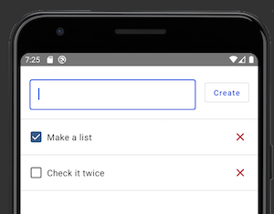
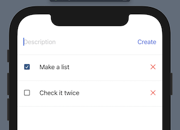

# To-Do

A Kotlin Multiplatform to-do list app with SwiftUI and Compose UI frontends

🎶  
_Making a list_  
_Checking it twice_  
_Gonna try out declarative UIs_  
🎵

 

### Disclaimer

I'm just starting to learn my way around both Compose and SwiftUI so the code here can probably be improved on.

## Shared code

The core logic in the `shared` module is implemented via SqlDelight
in [ToDo.sq](shared/src/commonMain/sqldelight/com/russhwolf/todo/shared/db/ToDo.sq). This is exposed in a Kotlin API
by [ToDoRepository](shared/src/commonMain/kotlin/com/russhwolf/todo/shared/repository/ToDoRepository.kt).

In addition to pure common code, there are some iOS-specific helpers. Since suspend functions and `Flow`s aren't
available to Swift, [FlowAdapter](shared/src/iosMain/kotlin/com/russhwolf/todo/shared/CoroutineAdapters.kt) is a
slightly modified version of the pattern I presented in
my [Working with Kotlin Coroutines and RxSwift](https://dev.to/touchlab/working-with-kotlin-coroutines-and-rxswift-24fa)
blog post. A wrapper
class [ToDoRepositoryIos](shared/src/iosMain/kotlin/com/russhwolf/todo/shared/repository/ToDoRepositoryIos.kt) then
exposes iOS-friendly versions of `ToDoRespository`'s API.

Unit tests verify the happy path for both repository classes, making use of
the [Turbine](https://github.com/cashapp/turbine) library for testing `Flow`s. Not a whole lot new there if you're used
to testing KMP code, but they're there to look at nonetheless.

## Android code

The Android app in the `androidApp` modules is a single
activity [ToDoActivity](androidApp/src/main/java/com/russhwolf/todo/androidApp/ToDoActivity.kt) which injects
a `ToDoRepository` into composable views defined
in [ToDoComposables.kt](androidApp/src/main/java/com/russhwolf/todo/androidApp/ToDoComposables.kt). There is a fully
interactable preview function `ToDoListPreview()` which exercises the UI without any dependence on the shared code by
manually wiring in-memory state

## iOS code

The iOS app in the `iosApp` directory consumes the repository in [SceneDelegate.swift](iosApp/ToDo/SceneDelegate.swift),
and renders it via SwiftUI views defined in [ToDoViews.swift](iosApp/ToDo/ToDoViews.swift). There is a fully
interactable preview view defined in `ToDoList_Previews` which exercises the UI without any dependence on the shared
code by manually wiring in-memory state.

The SwiftUI code makes use of some Combine helpers defined in [CombineAdapters.swift](iosApp/ToDo/CombineAdapters.swift)
in order to translate `FlowAdapter` to a `Published` value that SwiftUI can subscribe to. It also converts the Kotlin
`ToDo` class to a Swift `ToDo` struct via utilities in [ToDo.swift](iosApp/ToDo/ToDo.swift). This better matches typical
Swift development practices, and it means that the SwiftUI views have no direct dependence on the Kotlin code, which
apparently helps the preview work better. 